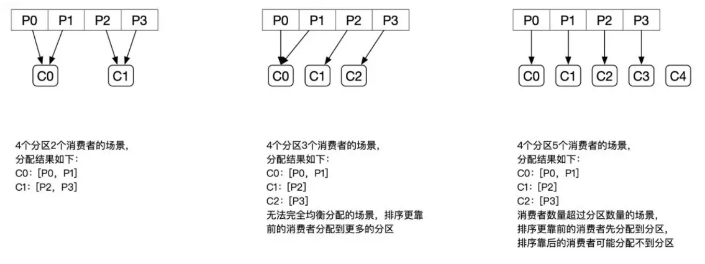
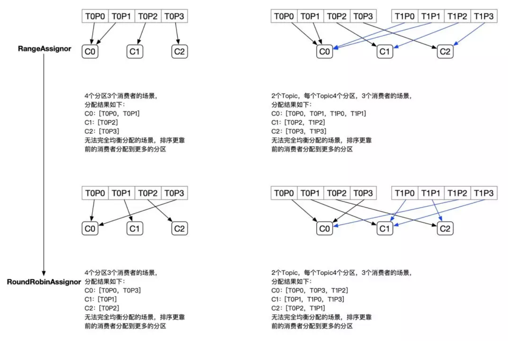
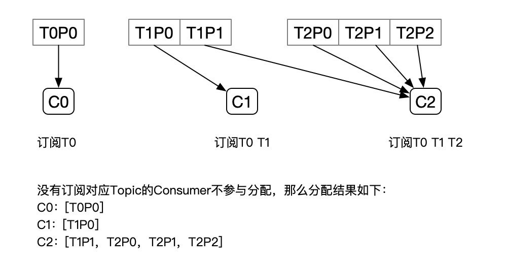
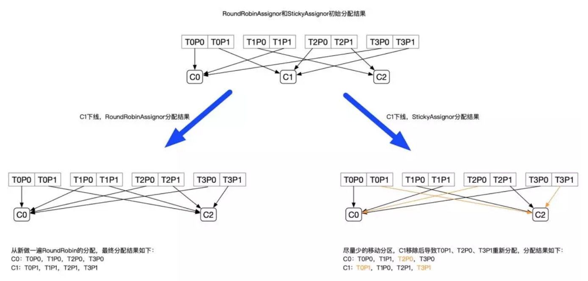
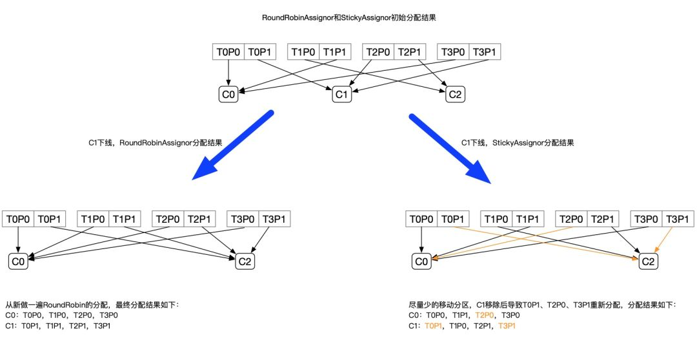
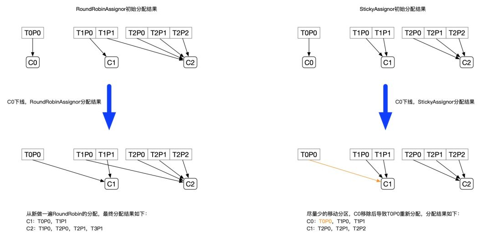

## 背景
在Kafka中，每个Topic会包含多个分区，默认情况下一个分区只能被一个消费组下面的一个消费者消费，这里就产生了分区分配的问题。Kafka中提供了多重分区分配算法（PartitionAssignor）的实现：RangeAssigor、RoundRobinAssignor、StickyAssignor。本文主要介绍StickyAssignor，顺带会介绍RangeAssigor、RoundRobinAssignor作为分区分配的背景知识。

<!-- more -->
### RangeAssignor
PartitionAssignor接口用于用户定义实现分区分配算法，以实现Consumer之间的分区分配。消费组的成员订阅它们感兴趣的Topic并将这种订阅关系传递给作为订阅组协调者的Broker。协调者选择其中的一个消费者来执行这个消费组的分区分配并将分配结果转发给消费组内所有的消费者。Kafka默认采用RangeAssignor的分配算法。
RangeAssignor对每个Topic进行独立的分区分配。对于每一个Topic，首先对分区按照分区ID进行排序，然后订阅这个Topic的消费组的消费者再进行排序，之后尽量均衡的将分区分配给消费者。这里只能是尽量均衡，因为分区数可能无法被消费者数量整除，那么有一些消费者就会多分配到一些分区。
分配示意图如下：

大致算法如下：
    ```
assign(topic, consumers) {
// 对分区和Consumer进行排序
List<Partition> partitions = topic.getPartitions();
sort(partitions);
sort(consumers);
// 计算每个Consumer分配的分区数
int numPartitionsPerConsumer = partition.size() / consumers.size();
// 额外有一些Consumer会多分配到分区
int consumersWithExtraPartition = partition.size() % consumers.size();
 // 计算分配结果
 for (int i = 0, n = consumers.size(); i < n; i++) {
 // 第i个Consumer分配到的分区的index
 int start = numPartitionsPerConsumer * i + Math.min(i, consumersWithExtraPartition);
 // 第i个Consumer分配到的分区数
 int length = numPartitionsPerConsumer + (i + 1 > consumersWithExtraPartition ? 0 : 1);
 // 分装分配结果
 assignment.get(consumersForTopic.get(i)).addAll(partitions.subList(start, start + length));
 }
    ```
RangeAssignor策略的原理是按照消费者总数和分区总数进行整除运算来获得一个跨度，然后将分区按照跨度进行平均分配，以保证分区尽可能均匀地分配给所有的消费者。对于每一个Topic，RangeAssignor策略会将消费组内所有订阅这个Topic的消费者按照名称的字典序排序，然后为每个消费者划分固定的分区范围，如果不够平均分配，那么字典序靠前的消费者会被多分配一个分区。
这种分配方式明显的一个问题是随着消费者订阅的Topic的数量的增加，不均衡的问题会越来越严重，比如上图中4个分区3个消费者的场景，C0会多分配一个分区。如果此时再订阅一个分区数为4的Topic，那么C0又会比C1、C2多分配一个分区，这样C0总共就比C1、C2多分配两个分区了，而且随着Topic的增加，这个情况会越来越严重。
分配结果：
订阅2个Topic，每个Topic4个分区，共3个Consumer
C0：[T0P0，T0P1，T1P0，T1P1]
C1：[T0P2，T1P2]
C2：[T0P3，T1P3]

### RoundRobinAssignor
RoundRobinAssignor的分配策略是将消费组内订阅的所有Topic的分区及所有消费者进行排序后尽量均衡的分配（RangeAssignor是针对单个Topic的分区进行排序分配的）。如果消费组内，消费者订阅的Topic列表是相同的（每个消费者都订阅了相同的Topic），那么分配结果是尽量均衡的（消费者之间分配到的分区数的差值不会超过1）。如果订阅的Topic列表是不同的，那么分配结果是不保证“尽量均衡”的，因为某些消费者不参与一些Topic的分配。
分配示意图如下:

相对于RangeAssignor，在订阅多个Topic的情况下，RoundRobinAssignor的方式能消费者之间尽量均衡的分配到分区（分配到的分区数的差值不会超过1——RangeAssignor的分配策略可能随着订阅的Topic越来越多，差值越来越大）。
对于订阅组内消费者订阅Topic不一致的情况：假设有三个消费者分别为C0、C1、C2，有3个Topic T0、T1、T2，分别拥有1、2、3个分区，并且C0订阅T0，C1订阅T0和T1，C2订阅T0、T1、T0，那么RoundRobinAssignor的分配结果如下：


看上去分配已经尽量的保证均衡了，不过可以发现C2承担了4个分区的消费而C1订阅了T1，是不是把T1P1交给C1消费能更加的均衡呢？

### StickyAssignor
#### 动机
尽管RoundRobinAssignor已经在RangeAssignor上做了一些优化来更均衡的分配分区，但是在一些情况下依旧会产生严重的分配偏差，比如消费组中订阅的Topic列表不相同的情况下（这个情况可能更多的发生在发布阶段，但是这真的是一个问题吗？——可以参照Kafka官方的说明：KIP-49 Fair Partition Assignment Strategy）。更核心的问题是无论是RangeAssignor，还是RoundRobinAssignor，当前的分区分配算法都没有考虑上一次的分配结果。显然，在执行一次新的分配之前，如果能考虑到上一次分配的结果，尽量少的调整分区分配的变动，显然是能节省很多开销的。
#### 目标
从字面意义上看，Sticky是“粘性的”，可以理解为分配结果是带“粘性的”——每一次分配变更相对上一次分配做最少的变动（上一次的结果是有粘性的），其目标有两点：
**1. 分区的分配尽量的均衡**
**2. 每一次重分配的结果尽量与上一次分配结果保持一致**
当这两个目标发生冲突时，优先保证第一个目标。第一个目标是每个分配算法都尽量尝试去完成的，而第二个目标才真正体现出StickyAssignor特性的。

我们先来看预期分配的结构，后续再具体分析StickyAssignor的算法实现。
例如：
	* 有3个Consumer：C0、C1、C2
	* 有4个Topic：T0、T1、T2、T3，每个Topic有2个分区
	* 所有Consumer都订阅了这4个分区


StickyAssignor的分配结果如下图所示（增加RoundRobinAssignor分配作为对比）：


上面的例子中，Sticky模式原来分配给C0、C2的分区都没有发生变动，且最终C0、C1达到的均衡的目的。
再举一个例子：
	* 有3个Consumer：C0、C1、C2
	* 3个Topic：T0、T1、T2，它们分别有1、2、3个分区
	* C0订阅T0；C1订阅T0、T1；C2订阅T0、T1、T2


分配结果如下图所示：


从以上两个例子的分配结果可以看出，StickyAssignor是比RangeAssignor和RoundRobinAssignor更好的分配方式，不过它的实现也更加的复杂。

#### 实现
StickyAssignor的实现代码是RangeAssignor和RoundRobinAssignor的十倍，复杂度则远远在十倍以上。目前基本没有看到对这块源码实现的分析。
StickyAssignor分配算法的核心逻辑如下：
1. 先构建出当前的分配状态：currentAssignment
	1. 如果currentAssignment为空，则是全新的分配
2. 构建出partition2AllPotentialConsumers和consumer2AllPotentialPartitions两个辅助后续分配的数据结构
	1. partition2AllPotentialConsumers是一个Map<TopicPartition, List<String>>，记录着每个Partition可以分配给哪些Consumer
	2. consumer2AllPotentialPartitions是一个Map<String, List<TopicPartition>>，记录着每个Consumer可以分配的Partition列表
3. 补全currentAssignment，将不属于currentAssignment的Consumer添加进去（如果新增了一个Consumer，这个Consumer上一次是没参与分配的，新添加进去分配的Partition列表为空）
4. 构建出currentPartitionConsumer来用于辅助的分配，currentPartitionConsumer记录了当前每个Partition分配给了哪个Consumer——就是把currentAssignment从Consumer作为Key转换到Partition作为Key用于辅助分配
5. 对所有分区进行排序（排序结果为sortedPartitions），排序有两种规则：
	1. 如果不是初次分配，并且每个Consumer订阅是相同的：
		1. 对Consumer按照它所分配的Partition数进行排序
		2. 按照上一步的排序结果，将每个Consumer分配的分区插入到List中（List就是排序后的分区）
		3. 将不属于任何Consumer的分区加入List中
	2. 否则：分区之间按照可以被分配的Consumer的数量进行排序
6. 构造unassignedPartitions记录所有要被分配的分区（初始为上一步排序过的所有分区，后续进行调整：将已分配的，不需要移除了Partition从unassignedPartitions中移除）
7. 进行分区调整，来达到分区分配均衡的目的；分区的Rebalance包含多个步骤
	1. 将上一步未分配的分区（unassignedPartitions）分配出去。分配的策略是：按照当前的分配结果，每一次分配时将分区分配给订阅了对应Topic的Consumer列表中拥有的分区最少的那一个Consumer
	2. 校验每一个分区是否需要调整，如果分区不需要调整，则从sortedPartitions中移除。分区是否可以被调整的规则是：如果这个分区是否在partition2AllPotentialConsumers中属于两个或超过两个Consumer。
	3. 校验每个Consumer是否需要调整被分配的分区，如果不能调整，则将这个Consumer从sortedCurrentSubscriptions中移除，不参与后续的重分配。判断是否调整的规则是：如果当前Consumer分配的分区数少于它可以被分配的最大分区数，或者它的分区满足上一条规则。
	4. 将以上步骤中获取的可以进行重分配的分区，进行重新的分配。每次分配时都进行校验，如果当前已经达到了均衡的状态，则终止调整。均衡状态的判断依据是Consumer之间分配的分区数量的差值不超过1；或者所有Consumer已经拿到了它可以被分配的分区之后仍无法达到均衡的上一个条件（比如c1订阅t1，c2订阅t2，t1 t2分区数相差超过1，此时没法重新调整）。如果不满足上面两个条件，且一个Consumer所分配的分区数少于同一个Topic的其他订阅者分配到的所有分区的情况，那么还可以继续调整，属于不满足均衡的情况——比如上文中RoundRobinAssignor的最后一个例子。
8. 后续流程和普通分配一致，就不分析了（Sticky模式会保存分配结果）


StickyAssignor的分配算法确实非常负责，笔者也是一步步Debug代码来分析整个过程的，希望上述分析的步骤对读者能有一些帮助（建议对照着上面的步骤去Debug Kafka源码中的单元测试来梳理这块内容）。

## 总结
本文主要介绍了Kafka的几种分区分配策略：RangeAssignor、RoundRobinAssignor、StickyAssignor。其中重点分析了StickyAssignor的实现，StickyAssignor的模式能比RangeAssignor和RoundRobinAssignor提供更加均衡的分配结果，在发生Consumer或者Partition变更的情况下，也能减少不必要的分区调整。总体而言StickyAssignor是一种更好的分配算法，只是实现上稍微有一些复杂。
